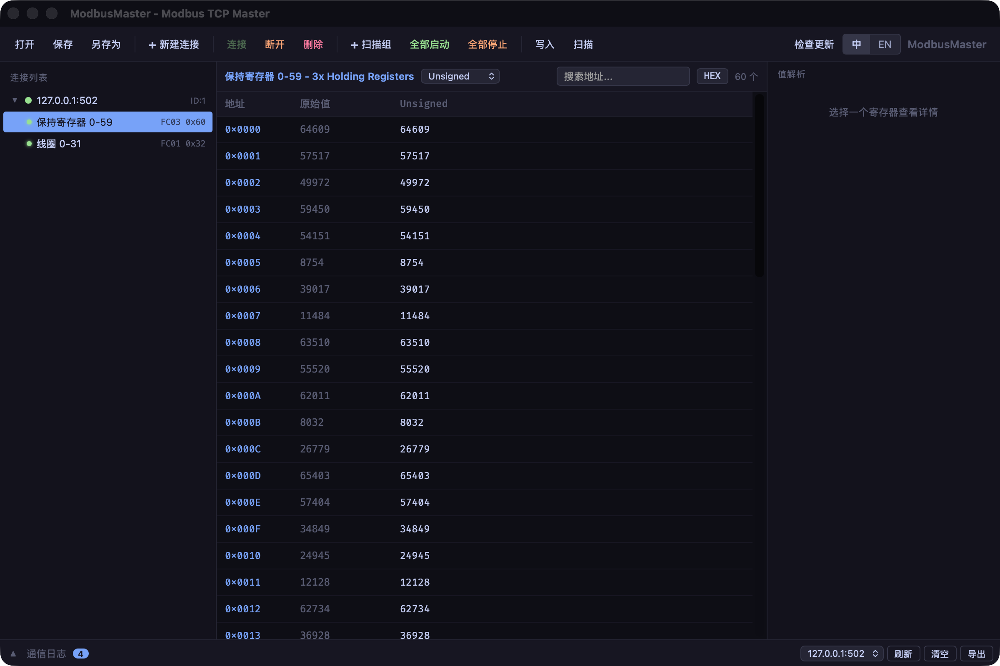
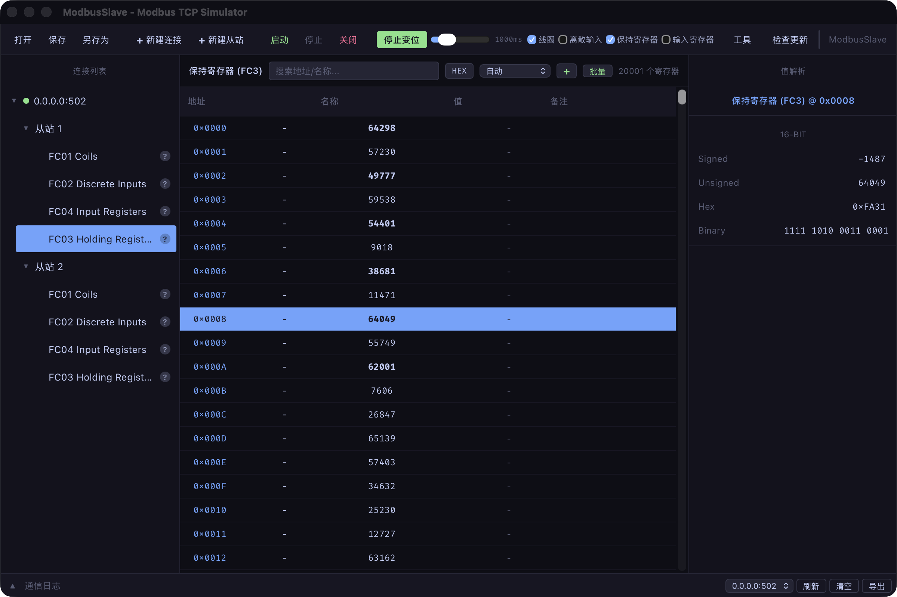
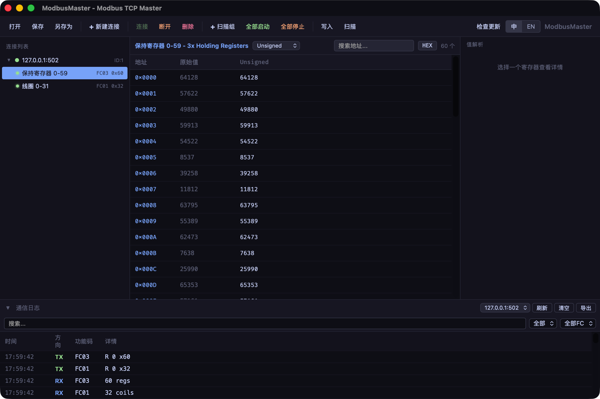
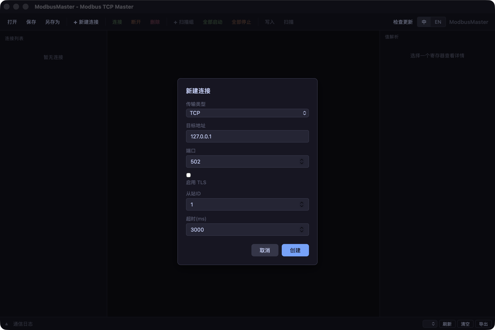

<div align="center">

# 🔌 ModbusSim

**A cross-platform Modbus simulator — Slave _and_ Master, in one desktop toolkit.**

[](https://github.com/Karl-Dai/ModbusSim/releases)
[](https://github.com/Karl-Dai/ModbusSim/releases)
[](https://github.com/Karl-Dai/ModbusSim/stargazers)
[](LICENSE)
[]()

Built with **Rust** · **Tauri 2** · **Vue 3**

**English** · [中文](README_CN.md)



</div>

---

## Why this project

Testing a Modbus integration usually means wiring up a real PLC or borrowing a master station. This project puts **both ends on your desktop**:

- 🛰️ **Slave & Master in one repo** — simulate a field device, or drive one, with no external hardware.
- 🔌 **Five transports, one core** — TCP, TCP+TLS, RTU, ASCII and RTU-over-TCP, covering function codes FC01–FC06 / FC15 / FC16.
- 📈 **Built-in data simulation** — drive registers with fixed / random / sine / sawtooth / triangle / counter / CSV-playback sources; 20,000+ registers with virtual scrolling.
- 🖥️ **Native desktop app** — small Rust + Tauri binaries for Windows, macOS and Linux, with in-app auto-update.
- 🌏 **Bilingual UI** — full English / 简体中文, switchable at runtime.

## Table of Contents

- [Screenshots](#screenshots)
- [Features](#features)
- [Download](#download)
- [Supported Function Codes](#supported-function-codes)
- [Transport Modes](#transport-modes)
- [Build from Source](#build-from-source)
- [Quick Start](#quick-start)
- [Architecture](#architecture)
- [Contributing](#contributing)
- [Changelog](#changelog)
- [macOS First Launch](#macos-first-launch)
- [License](#license)

## Screenshots

**Slave · 20,000 registers with live random mutation**

ModbusSlave runs a real Modbus TCP server on `0.0.0.0:502` with two slave devices. The register table virtual-scrolls through 20,000+ holding registers; **Random Mutation** changes values in place (orange flashes) and the value panel on the right decodes the selected register as Signed / Unsigned / Hex / Binary at once.



**Master · communication log with decoded TX/RX frames**

The bottom log panel records every request/response pair — direction, function code and a readable detail (`R 0 x60`, `60 regs`) side by side, filterable by direction / FC / text and exportable to CSV.



## Features

### 🛰️ ModbusSlave — Slave Simulator

- **Multi-transport** — TCP, TCP+TLS, RTU (serial), ASCII (serial), RTU-over-TCP
- **Modbus TCP over TLS** — TLS 1.2+ encryption, PEM and PKCS#12 certificate formats, optional mTLS (mutual authentication with client certificates)
- **Multiple slave devices** — create connections on any port, add multiple slave devices per connection
- **Four register types** — Coils (FC01), Discrete Inputs (FC02), Holding Registers (FC03), Input Registers (FC04)
- **Full protocol support** — Read (FC01–04), Write Single (FC05/06), Write Multiple (FC15/16), with Modbus exception codes
- **Register table** — address search/filter, inline value editing, Ctrl/Shift multi-select, virtual scrolling (20,000+ registers), multi-format display (Auto / U16 / I16 / Hex / Bin / Float32 with 4 byte orders)
- **Default initialization** — new slaves pre-fill addresses 0–20,000 across all four register types; batch-add supports up to 50,000 entries per operation
- **Value panel** — Signed/Unsigned/Hex/Binary (16-bit), Long/Float (32-bit), Double (64-bit), all byte orders (AB CD / CD AB / BA DC / DC BA)
- **Dynamic data sources** — simulate changing register values: Fixed, Random, Sine, Sawtooth, Triangle, Counter, CSV playback
- **Communication log** — real-time TX/RX logging with search, direction/function-code filtering, and CSV export
- **Project files** — save/load complete configurations as `.modbusproj` files for quick scenario switching
- **Serial port support** — auto-detect system serial ports, configurable baud rate, data bits, stop bits, parity

### 📡 ModbusMaster — Master Tool

- **Multi-transport** — TCP, TCP+TLS, RTU (serial), ASCII (serial), RTU-over-TCP
- **Modbus TCP over TLS** — TLS 1.2+ encryption, PEM and PKCS#12 certificate formats, accept-invalid-certs mode for self-signed certificate testing
- **Scan groups** — periodic polling with custom intervals per register group, per-group slave ID override
- **Device discovery** — slave ID scan (1–247), register address scan, auto-add discovered devices to scan groups
- **Multi-format data view** — Unsigned, Signed, Hex, Binary, Float32 (AB CD / CD AB), virtual scrolling
- **Write operations** — write single/multiple coils and registers (FC05/06/15/16)
- **Communication log** — TX/RX logging with search/filter (direction, function code, text) and CSV export
- **Auto-reconnect** — configurable reconnection with exponential backoff (1s → 2s → 4s → … → 30s max)
- **Project files** — save/load connection and scan group configurations
- **Connection-on-scan** — auto-prompt to scan devices after a successful connection
- **In-app auto-update** from GitHub Releases (signed bundles, 6 h check throttle, "later" snoozes 24 h)

### 🧩 Shared Architecture

- **Unified error system** — structured `ModbusError` with categorized error types (connection/protocol/application), serialized to JSON for frontend parsing
- **Shared Vue components** — common composables, types and i18n shared between both Tauri apps via the `shared-frontend` npm workspace

## Download

Pre-built installers for every platform are on the **[Releases page](https://github.com/Karl-Dai/ModbusSim/releases)**.

| Platform | Installer |
|----------|-----------|
| Windows  | `.msi` / `.exe` (NSIS) |
| macOS    | `.dmg` (Apple Silicon & Intel) |
| Linux    | `.AppImage` / `.deb` / `.rpm` |

Both apps **auto-update** from GitHub Releases since v0.16.0. macOS users need [one extra step on first launch](#macos-first-launch).

> **Note:** As of v0.16, the native egui edition (assets with the `-egui-` suffix) is discontinued. Please migrate to the Tauri installers listed above.

### China mirror

Users in mainland China may have unstable access to GitHub Releases. Recommended mirror for direct installer downloads:

- <https://ghfast.top/https://github.com/Karl-Dai/ModbusSim/releases/latest>

Starting from v0.16.0, the in-app updater automatically falls back through multiple proxies — no manual action needed. However, **the very first upgrade from a pre-0.16 build** has no in-app updater at all; download and install the new version once via the mirror above, after which updates route through proxies automatically.

## Supported Function Codes

| Code | Function | Slave (Server) | Master (Client) |
|------|----------|:-:|:-:|
| FC01 | Read Coils | Read | Read/Poll |
| FC02 | Read Discrete Inputs | Read | Read/Poll |
| FC03 | Read Holding Registers | Read | Read/Poll |
| FC04 | Read Input Registers | Read | Read/Poll |
| FC05 | Write Single Coil | Write | Write |
| FC06 | Write Single Register | Write | Write |
| FC15 | Write Multiple Coils | Write | Write |
| FC16 | Write Multiple Registers | Write | Write |

## Transport Modes

| Mode | Transport | Framing | Use Case |
|------|-----------|---------|----------|
| TCP | TCP/IP socket | MBAP header | Standard Modbus TCP |
| TCP+TLS | TLS over TCP | MBAP header | Secure Modbus TCP (TLS 1.2+) |
| RTU | Serial port | Slave ID + CRC-16 | RS-485/RS-232 devices |
| ASCII | Serial port | `:` + hex + LRC + CRLF | Legacy serial devices |
| RTU-over-TCP | TCP/IP socket | Slave ID + CRC-16 | Industrial gateways |

## Build from Source

### Prerequisites

- [Rust](https://rustup.rs/) 1.77+
- [Node.js](https://nodejs.org/) 18+
- [Tauri CLI](https://tauri.app/) — `cargo install tauri-cli`

### Steps

```bash
# install frontend dependencies (npm workspaces — run once at the repo root)
npm install

# run the Slave
cd crates/modbussim-app && cargo tauri dev

# run the Master
cd crates/modbusmaster-app && cargo tauri dev
```

### Build installers

```bash
cd crates/modbussim-app && cargo tauri build
cd crates/modbusmaster-app && cargo tauri build
```

### Run tests

```bash
cargo test --workspace
```

## Quick Start

A full round-trip in four steps — drive the simulated Slave from the Master, no hardware required. (Screenshots show the Chinese UI; flip to English any time with the **中 / EN** toggle.)

### 1 · Slave — create a server with registers

Open **ModbusSlave** and click **新建连接 (New Connection)**: pick TCP, a port (e.g. `502`) and random initialization — the server starts with a device pre-filled across all four register types (coils, discrete inputs, holding and input registers). Turn on **随机变化 (Random Mutation)** to make values move; click any row to decode it in the value panel.


### 2 · Master — create a connection

Open **ModbusMaster** and click **新建连接 (New Connection)**. The defaults already target the local Slave: address `127.0.0.1`, port `502`, slave ID `1`. Tick **启用 TLS (Enable TLS)** for a secure link. Click **创建 (Create)**, then **连接 (Connect)**.



### 3 · Master — scan groups fill the table

Add scan groups (e.g. holding registers 0–59 and coils 0–31) and start polling. The connection tree shows each group with its function code and range; the table refreshes on every poll with the values served by the Slave.


### 4 · Watch the wire

Expand **通信日志 (Communication Log)** at the bottom: every TX/RX pair is decoded — direction, function code and a readable detail. Back on the Slave, mutated values surface in the Master's table on the next poll. Write back from the Master (FC05/06/15/16) and confirm the change lands on the Slave.


## Architecture

```
ModbusSim/
├── crates/
│   ├── modbussim-core/        # Core library: protocol, transport, registers, logging
│   │   └── src/
│   │       ├── slave.rs       # Slave connection (TCP/RTU/ASCII/RtuOverTcp dispatch)
│   │       ├── master.rs      # Master connection with multi-transport support
│   │       ├── frame.rs       # RTU/ASCII frame encode/decode
│   │       ├── pdu.rs         # Modbus PDU request/response parsing
│   │       ├── transport.rs   # Transport enum, serial config, TLS config, port enumeration
│   │       ├── mbap.rs        # MBAP frame encoding/decoding (for TLS mode)
│   │       ├── tls_slave.rs   # TLS-enabled Modbus TCP slave server
│   │       ├── tls_master.rs  # TLS-enabled Modbus TCP master client
│   │       ├── register.rs    # Register types, encoding/decoding
│   │       ├── data_source.rs # Dynamic data sources for register simulation
│   │       ├── reconnect.rs   # Reconnect policy with exponential backoff
│   │       ├── error.rs       # Unified ModbusError enum
│   │       ├── project.rs     # .modbusproj file save/load/migrate
│   │       └── log_collector.rs # Thread-safe log ring buffer
│   ├── modbussim-app/         # Slave Tauri application
│   └── modbusmaster-app/      # Master Tauri application
├── frontend/                  # Slave Vue 3 frontend
├── master-frontend/           # Master Vue 3 frontend
└── shared-frontend/           # Shared Vue components, composables, i18n
```

| Layer | Stack |
|-------|-------|
| Backend | Rust, Tokio (async runtime), [tokio-modbus](https://github.com/slowtec/tokio-modbus), [tokio-serial](https://github.com/berkowski/tokio-serial), [native-tls](https://crates.io/crates/native-tls) (macOS Security.framework / Linux OpenSSL / Windows SChannel), [serialport](https://crates.io/crates/serialport) |
| Frontend | Vue 3, TypeScript, Vite, [@tanstack/vue-virtual](https://tanstack.com/virtual) |
| Desktop | Tauri 2 |

## Contributing

Issues and pull requests are welcome. For a code change, please make sure `cargo test --workspace` passes (plus the frontend type checks) before opening a PR.

## Changelog

See [CHANGELOG.md](CHANGELOG.md) or the [Releases page](https://github.com/Karl-Dai/ModbusSim/releases).

Starting from v0.16.0, both apps check GitHub Releases on startup and prompt to install new versions. Users on pre-0.16 builds need to upgrade manually once.

## macOS First Launch

The bundles are **not Apple-notarized** (no paid Developer Program). On first launch macOS shows *"ModbusSlave / ModbusMaster cannot be opened — Apple could not verify…"* with only *Done* and *Move to Trash* buttons. This is the standard macOS 15 (Sequoia) block for ad-hoc-signed apps — the app is **not damaged**.

<details>
<summary><b>How to allow it (pick one)</b></summary>

**1. GUI path**

- Double-click the `.app`, see the block dialog, click *Done*.
- Open *System Settings → Privacy & Security*, scroll to the bottom.
- You'll see *"ModbusSlave was blocked…"* — click *Open Anyway* and enter your password.
- The next dialog has an *Open* button; click it. Subsequent launches go straight through.

**2. One-line Terminal**

```bash
xattr -dr com.apple.quarantine "/Applications/ModbusSlave.app"
xattr -dr com.apple.quarantine "/Applications/ModbusMaster.app"
```

Strips the quarantine flag so macOS stops blocking.

</details>

## Anonymous Usage Analytics

ModbusSim sends an anonymous `app_started` event on launch via [Aptabase](https://aptabase.com), so the author can see install counts, active usage, and version/OS distribution. It collects **no personal data** — only app version, OS, locale, and an approximate country derived from your IP (the IP itself is never stored). You can turn it off anytime via the ⓘ "About" popover in the toolbar.

## License

[MIT](LICENSE)
